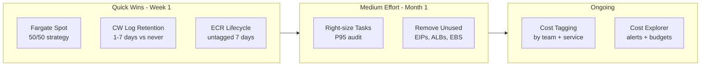

# Cost Optimization Playbook

A step-by-step guide to reducing AWS ECS Fargate costs for a multi-service production platform.

---

## Strategy Overview



---

## Tactic 1: Fargate Spot (50/50)

**Impact:** ~40-45% compute cost reduction

### How it works
Fargate Spot uses spare AWS capacity at a ~70% discount. Tasks can be interrupted with a 2-minute warning. For stateless services that handle SIGTERM gracefully, this is a free win.

### Implementation

```hcl
default_capacity_provider_strategy = {
  FARGATE      = { weight = 50 }
  FARGATE_SPOT = { weight = 50 }
}
```

### Which services should NOT use Spot

| Service type | Use Spot? | Reason |
|-------------|-----------|--------|
| Stateless API services | Yes | SIGTERM → drain → terminate |
| Background workers (idempotent) | Yes | Retry on restart |
| Kafka consumers | Careful | Use `enable.auto.commit=false` + offset commit before SIGTERM |
| ClickHouse / databases | No | Data loss risk |
| Jenkins CI agents | Yes | Worst case: retry the build |

### Graceful shutdown (required for Spot)

```python
# Python example: handle SIGTERM
import signal, sys

def sigterm_handler(signum, frame):
    print("SIGTERM received, draining connections...")
    server.shutdown()  # stop accepting new requests
    sys.exit(0)

signal.signal(signal.SIGTERM, sigterm_handler)
```

---

## Tactic 2: ECR Lifecycle Policies

**Impact:** ~$120/mo for 37-service platform

Each service generates multiple untagged image layers per CI build. Without lifecycle policies, these accumulate silently.

```hcl
repository_lifecycle_policy = jsonencode({
  rules = [
    {
      rulePriority = 1
      description  = "Delete untagged images after 7 days"
      selection = {
        tagStatus   = "untagged"
        countType   = "sinceImagePushed"
        countUnit   = "days"
        countNumber = 7
      }
      action = { type = "expire" }
    },
    {
      rulePriority = 2
      description  = "Keep only 10 most recent tagged images"
      selection = {
        tagStatus     = "tagged"
        tagPrefixList = ["v", "sha-"]
        countType     = "imageCountMoreThan"
        countNumber   = 10
      }
      action = { type = "expire" }
    }
  ]
})
```

**UAT pattern:** Skip ECR for UAT environments — UAT pulls images from STG ECR. This halves the number of repos without affecting deployment.

---

## Tactic 3: CloudWatch Log Retention

**Impact:** ~$180/mo for 37-service platform

AWS CloudWatch log groups default to **never expire**. At $0.50/GB ingestion + $0.03/GB storage, verbose debug logs from 37 services add up fast.

| Log type | Recommended retention |
|----------|----------------------|
| ECS exec logs (`execute-command`) | 1 day |
| Application debug logs | 3 days |
| Application access/HTTP logs | 7 days |
| Audit / security logs | 90-365 days |

```hcl
resource "aws_cloudwatch_log_group" "ecs_exec" {
  name              = "/aws/ecs/${var.environment}-${var.cluster_name}"
  retention_in_days = 1  # exec logs are only useful for active debugging
}
```

---

## Tactic 4: Right-sizing

**Impact:** ~$900/mo for 37-service platform

Most services are provisioned based on "felt right" estimates at launch. Running the rightsizing audit after 2 weeks of production traffic reveals the real picture.

```bash
./scripts/rightsizing-audit.sh --cluster prd-platform --days 14 --output csv
```

**Common findings:**
- Services with 1 vCPU reservation but P95 CPU < 100m (0.1 vCPU) — reduce to 256m
- Services with 2GB memory reservation but P95 usage < 400MB — reduce to 512MB
- Background workers that are mostly idle — consolidate into a single task

---

## Tactic 5: Unused Resources Cleanup

**Impact:** ~$80/mo

Resources that outlive the services they supported:

| Resource | Monthly cost if unused |
|----------|----------------------|
| Elastic IP (unattached) | $3.65/EIP |
| Application Load Balancer (idle) | $16/ALB + LCU charges |
| EBS volume (unattached) | $0.10/GB-month (gp3) |
| NAT Gateway (low traffic) | $0.045/hr + data |

```bash
./scripts/unused-resources.sh --region ap-southeast-1
```
